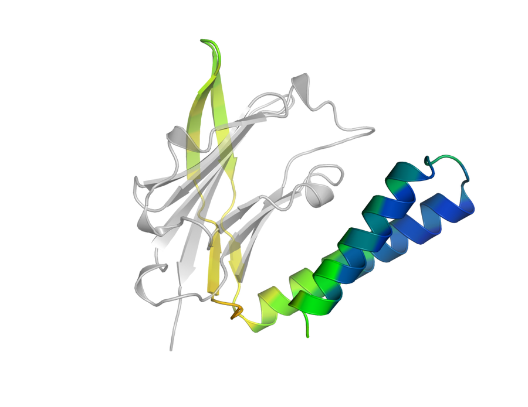
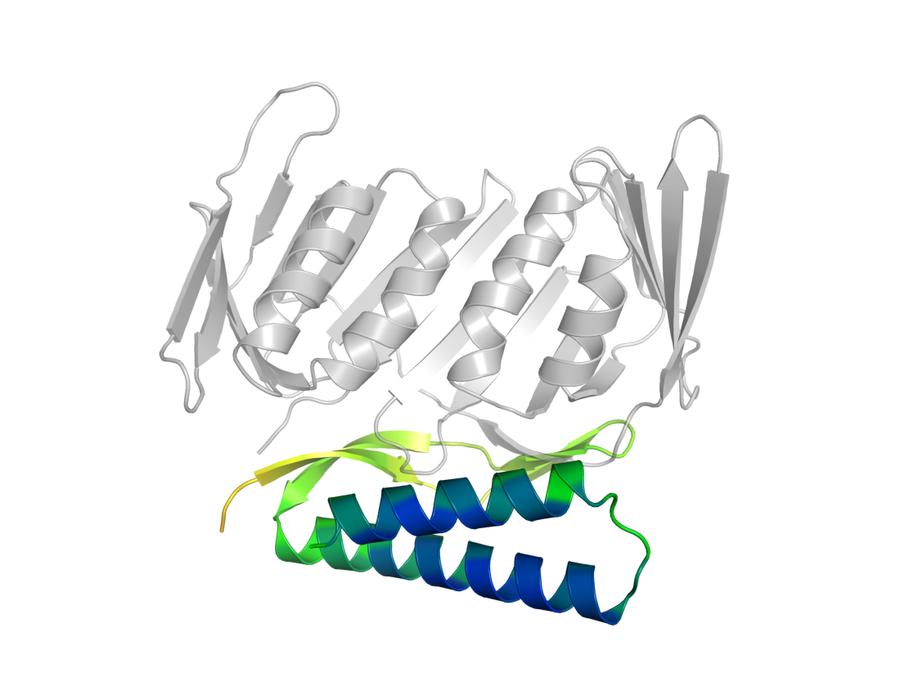

# switch-pipeline

switch-pipeline designs a single protein sequence that adopts two different
bound conformations, one against each of two protein targets. It generates a
binder backbone against the first target with RFdiffusion3, derives a second
conformation from that backbone by partial diffusion, designs one sequence tied
across both states with DynamicMPNN, and ranks the candidates with an AlphaFold2
initial-guess gate calibrated against composition-matched scramble controls.
A run produces a ranked candidate list with per-design evidence, a comparison
against ProteinMPNN multi-state design at equal budget, and the diagnostics
behind both. Everything target-specific is read from a YAML config, so the same
pipeline applies to any pair of protein targets; the configs supplied here use
PD-L1 as the first target and PCNA as the second.

| State 1 — binder on PD-L1 | State 2 — same sequence on PCNA |
|---|---|
|  |  |

Top-ranked design of the reference production run
(`pdl1_igv_1145_0006_sample_030`, two-state AF2 pLDDT 0.79), shown as the Boltz-2
predicted complex for each state. The binder is coloured by per-residue pLDDT
from red (low) to blue (high) and each target is grey.

## How it works

```
RFdiffusion3 ─► state-1 backbone ─► partial diffusion ─► state-2 backbone
                                    (apo_target.partial_t)
                          │
              DynamicMPNN ─ one tied sequence, both states
                          │
              AF2 initial-guess two-state gate + paired scramble nulls
                          │
              Boltz-2 scoring ─► ranking ─► results/
```

Selection runs on AF2 initial-guess confidence, evaluated in both states at
once, and a design is only as good as its weaker state. Before a metric is
allowed to rank anything, it has to separate real designs from scrambled
sequences of identical amino-acid composition at the AUC set in the config.
Metrics that fail that test, along with the Boltz-2 co-folding scores, are still
computed and written out, but they are reported as diagnostics rather than used
for selection.

## Installation

The pipeline runs on GPU nodes under Slurm. Partitions are configured in
`src/pipeline_context.py`, and the paths in `configs/` and `slurm/` point at the
cluster it was developed on, so both need adapting elsewhere.

Start by cloning the repository and fetching the tools it orchestrates:

```bash
git clone https://github.com/Maximilianvsn/switch-pipeline.git
cd switch-pipeline
bash scripts/setup.sh
```

`setup.sh` clones ProteinMPNN, LigandMPNN, DynamicMPNN, Boltz-2 and ProtFlow at
the commits the pipeline was validated against, then applies the local
modifications kept in `patches/`. It does not create environments or download
weights, both of which are large and cluster-specific.

The pipeline then needs four conda environments, because AF2 initial-guess
requires JAX and colabdesign while RFdiffusion3 and Boltz-2 require PyTorch, and
the two CUDA stacks cannot be installed together. The orchestrator therefore
calls the other tools as subprocesses rather than importing them, and each
environment is named in the config rather than hard-coded.

| Environment | Role | Config key |
|---|---|---|
| `protflow` | orchestrator, the only one you activate yourself | created from `env/environment.yml` |
| `BindCraft` | AF2 initial-guess gate | `af2.bindcraft_env` |
| `dynamicmpnn` | DynamicMPNN sequence design | `dynamicmpnn.conda_env` |
| `ligandmpnn_env` | LigandMPNN and ProteinMPNN-MSD | `proteinmpnn_msd.python` |

Only the orchestrator environment is specified here:

```bash
conda env create -f env/environment.yml
```

The other three are built from their upstream projects. Model weights are
obtained separately, as described in `env/DEPENDENCIES.md`: the DynamicMPNN
checkpoint, the ProteinMPNN and LigandMPNN parameters, and a localcolabfold
install for the AF2 gate. Boltz-2 downloads its own weights on first use.

Finally, copy `configs/template.yaml` and point it at your installation, that is
at the four environments above, the DynamicMPNN checkpoint, the ProteinMPNN
weights and the AF2 parameter directory. Nothing in `src/` needs editing to run
a new target pair.

## Running

A production run is submitted through one of the Slurm wrappers, which activates
the orchestrator environment and launches the pipeline for you:

```bash
mkdir -p logs                                     # the wrappers write logs here
sbatch slurm/submit_protein_only_nogate.sh my_run
```

The run name is optional; without one the wrapper picks the next unused
`production_proteins_pdl1_pcna_nogate_<date>_vN`. You can equally run the
pipeline directly, which is useful when you want to watch it:

```bash
conda activate protflow
python -u src/switch_pipeline.py --config configs/pdl1_pcna_protein_only_nogate.yaml \
                                 --run-name my_run
```

Either way the orchestrator itself runs on CPU and submits one GPU array job per
stage, so the process has to stay alive for the whole run, which is why the
wrappers request a long walltime on a CPU partition. Progress is visible in
`outputs/my_run/funnel_summary.csv`, which is rewritten after every stage and
records how many designs survived each filter.

Re-submitting under an existing run name resumes that run: completed stages are
loaded from their cached scorefiles instead of being recomputed, which also
makes it cheap to enable a later stage, such as the ProteinMPNN-MSD comparator,
and re-run only that part. Each run stores its resolved settings in
`run_provenance.json` and refuses to resume if the config has changed since.

Four configs are supplied:

| Config | Purpose |
|---|---|
| `pdl1_pcna_protein_only.yaml` | production; stops before the expensive scoring unless the null test passes |
| `pdl1_pcna_protein_only_nogate.yaml` | production; the null is computed and reported but never blocks the run |
| `pdl1_pcna_protein_only_pilot.yaml` | reduced budget, for checking parameters before committing to a full run |
| `template.yaml` | annotated starting point for a new target pair |

## Configuration

All settings for a run live in one YAML file. In the tables below, `prod` is the
value used in production and `default` the fallback applied when the key is
absent. The two states are named `holo_target` and `apo_target` in the config
keys and output columns; this document refers to them as state 1 and state 2.

### `holo_target` / `apo_target` — the two targets

| Key | Example | Description |
|---|---|---|
| `pdb` | `inputs/pdl1_igv.pdb` | target structure, a single chain spanning the contig |
| `sequence` | `MTIECKF…` | sequence scored by Boltz-2; the residues present in the PDB, not the full UniProt entry |
| `contig` | `A19-115,/0,80` | fixed target range, `/0` chain break, then binder length (or a range such as `60-100`) |
| `hotspots` | `A56,A58,A113,A115` | target residues the binder should contact; solvent-exposed and near the pocket |
| `binder_chain` | `B` | binder chain in the RFdiffusion3 output (state 1 only) |
| `partial_t` | `12.0` | state 2 only. Partial-diffusion noise in Å applied to the state-1 binder; dominates yield |

State 2 is derived from state 1 and inherits its binder length, so it needs no
`contig` of its own.

### `sampling`

| Key | Prod | Default | Effect |
|---|---|---|---|
| `holo_batch` | 1200 | 200 | state-1 backbones to diffuse. Backbone identity explains most of the variance in downstream success |
| `apo_batch` | 12 | 5 | state-2 candidates per surviving state-1 backbone, the narrowest point of the funnel. Above 1 this requires `af2.state2_designability.enabled` |
| `diffusion_batch_size` | 10 | 10 | per-GPU-call batch, memory-bound. The total per pose is `n_batches × diffusion_batch_size` |
| `lmpnn_nseq` | 8 | 50 | LigandMPNN proxy sequences per backbone, used for triage |
| `dmpnn_nseq` | 32 | 20 | DynamicMPNN sequences per backbone; the method under evaluation |
| `mpnn_msd_nseq` | 32 | 20 | ProteinMPNN-MSD sequences per backbone; keeping it equal to `dmpnn_nseq` gives a matched budget |
| `dmpnn_temperature` | 0.15 | 0.1 | DynamicMPNN sampling temperature; higher values give more diversity per design |
| `adaptive_target` | 0 | 0 | gate passes per backbone below which further sequences are generated. `0` disables the top-up |
| `adaptive_max_nseq` | 32 | = `dmpnn_nseq` | ceiling for that top-up |
| `final_boltz_samples` | 1 | 3 | Boltz diffusion samples per final state |

### `filtering`

| Key | Prod | Default | Effect |
|---|---|---|---|
| `lmpnn_top_k` | 1 | 1 | proxy sequences kept per backbone entering triage |
| `selfcons_plddt_threshold` | 0 | 0 | minimum binder-monomer pLDDT in both states. `0` ranks without filtering |
| `selfcons_iptm_threshold` | 0 | 0 | minimum no-MSA complex ipTM in both states |
| `selfcons_rmsd_decoy_threshold` | 0 | 0 | maximum target/decoy RMSD ratio |
| `max_backbones` | 80 | 40 | backbones entering sequence design, ranked by the lower of the two monomer pLDDTs; the main cost cap |
| `post_dmpnn_top_k` | 0 | 0 | sequences per backbone forwarded by the cheap proxy. `0` scores all and defers to the AF2 gate |
| `post_af2_top_k` | 80 | 180 | designs forwarded from the AF2 gate to Boltz-2 by harmonic pLDDT, as a fixed cap |
| `post_af2_per_backbone` | 1 | 0 | maximum forwarded per backbone, applied before the cap |

### `af2` — the discriminative gate

| Key | Prod | Default | Effect |
|---|---|---|---|
| `enabled` | true | false | master switch. With the gate off, selection falls back to a Boltz-2 proxy |
| `bindcraft_env` | *path* | — | conda environment providing colabdesign and JAX |
| `params_dir` | `tools_af2/localcolabfold/colabfold` | — | AF2 parameter directory |
| `num_recycles` | 3 | 3 | AF2 recycles per prediction |
| `shard_size` | 300 | — | predictions per Slurm array task |
| `structures_shard_size` | 60 | — | shard size for the slower structure-writing pass |

`af2.designability` is the state-1 pre-filter, applied immediately after
generation so that undesignable backbones never reach the expensive stages.

| Key | Prod | Effect |
|---|---|---|
| `enabled` | true | activate the pre-filter |
| `n_seqs` | 8 | ProteinMPNN proxy sequences per backbone |
| `pre_af2_top_k` | 4 | how many of those reach AF2 |
| `min_plddt` / `max_i_pae` / `min_i_ptm` | 0.7 / 0.4 / 0.4 | pass thresholds |

`af2.state2_designability` applies the same filter to state-2 candidates and
selects one candidate per state-1 backbone. Its thresholds sit below those of
state 1, which is the easier side of the problem.

| Key | Prod | Effect |
|---|---|---|
| `enabled` | true | required when `sampling.apo_batch` is above 1 |
| `n_seqs` / `pre_af2_top_k` | 8 / 2 | proxy sequences, and how many reach AF2. This stage dominates the AF2 budget |
| `min_plddt` / `max_i_pae` / `min_i_ptm` | 0.6 / 0.5 / 0.3 | pass thresholds |
| `target_rmsd` | 3.0 | preferred state-1 to state-2 binder RMSD, used only as a tie-break |

`af2.strict_abs` holds the absolute thresholds for the strict tier, which a
design must clear in both states.

| Key | Prod | Effect |
|---|---|---|
| `plddt` | 0.8 | binder pLDDT |
| `i_pae` | 0.34 | interface PAE, normalised 0–1; 0.34 corresponds to the 10 Å literature criterion |
| `i_ptm` | 0.5 | interface pTM |

### `geometry_gate`

Applied to state pairs before any sequence work, this gate requires the two
states to reuse a common binder surface while keeping the two targets mutually
exclusive.

| Key | Prod | Effect |
|---|---|---|
| `enabled` | true | zero passing pairs is a valid outcome and ends the run |
| `generation_sanity_min_binder_ca_rmsd` | 0.25 | floor that catches a state 2 identical to state 1 |
| `min_binder_ca_rmsd` / `max_binder_ca_rmsd` | 1.0 / 8.0 | admissible conformational-change window in Å |
| `min_interface_jaccard` | 0.15 | symmetric overlap of the two interface-residue sets |
| `min_interface_reuse_fraction` | 0.3 | directional shared-surface requirement |
| `min_target_target_clash_pairs` | 5 | clashing atom pairs when both targets sit on the shared surface, the mutual-exclusion proxy |
| `min_interface_residues_per_state` | 5 | minimum interface size in either state |
| `interface_cutoff` / `clash_cutoff` | 5.0 / 2.5 | contact and clash distances in Å |

### `evaluation`

| Key | Prod | Default | Effect |
|---|---|---|---|
| `n_scramble_controls` | 80 | 0 | composition-matched scrambles per run, scored identically. `0` disables null calibration |
| `require_null_separation` | false | true | skip the expensive scoring unless the null test passes |
| `min_null_auc` | 0.6 | 0.70 | AUC each metric must reach against the paired null |
| `min_null_pairs` | 20 | 10 | minimum paired backbones for that test to count |
| `forward_only_af2_passes` | false | true | forward only designs that passed the gate |
| `score_msd` | true | false | run the ProteinMPNN-MSD comparator |
| `enforce_equal_method_budget` | true | false | require `mpnn_msd_nseq == dmpnn_nseq` |
| `four_state_control` | false | true | off-diagonal target controls |

### `dynamicmpnn` / `proteinmpnn_msd` / `specificity`

| Key | Description |
|---|---|
| `dynamicmpnn.conda_env` | environment holding the DynamicMPNN install |
| `dynamicmpnn.checkpoint` | model checkpoint |
| `proteinmpnn_msd.script` | ProteinMPNN entry point; omitting the block disables the comparator |
| `proteinmpnn_msd.helper_parse` / `helper_tied` | multi-chain parsing and tied-position helpers |
| `proteinmpnn_msd.weights` | ProteinMPNN weights directory |
| `proteinmpnn_msd.python` | interpreter from the LigandMPNN environment |
| `specificity.enabled` | off-target decoy panel; the structures are listed under `decoy_targets` |
| `labels.*` | display names for figures and CSV headers |

### Calibrating `partial_t`

`partial_t` controls how far state 2 diverges from state 1 and dominates the
yield of the whole run, so it is worth calibrating before production.
`slurm/submit_partial_t_calibration.sh` runs generation and the geometry gate
across several values on one shared set of state-1 backbones, then stops before
sequence design.

The selection rule is fixed in code before the results are seen: a value must
produce at least three geometry passes spanning two state-1 backbones, and among
those the one with the highest lower Wilson bound on backbone-level success
wins, with ties broken on proximity to `target_rmsd` and then on lower variance.

## Outputs

Everything a run writes lands in `outputs/<run>/`, of which `results/` is the
curated subset worth reading first.

| File | Content |
|---|---|
| `results/1_candidates.csv` | ranked designs with their evidence tier |
| `results/2_backbone_evidence.csv` | backbone-level separation from matched scrambles |
| `results/3_method_comparison.csv` | DynamicMPNN against ProteinMPNN-MSD at equal budget |
| `results/4_run_summary.txt` | funnel counts and the claims they support |
| `results/figures/` | null audits, method comparison, switch diagnostics |
| `funnel_summary.csv` | per-stage design counts |
| `af2_null_separation.csv` | per-metric AUC against the paired null |
| `s2_state_pair_geometry.csv` | backbone-level geometry-gate audit |
| `run_provenance.json` | the config and pipeline version that produced the run |

The metrics in those files are:

| Metric | Definition |
|---|---|
| `i_pae` | interface PAE, normalised 0–1 (×31 ≈ Å); below 0.34 is the 10 Å literature criterion |
| `pLDDT` | fold confidence |
| `switch_plddt` | harmonic mean across the two states, so a design is bounded by its weaker state |
| `AUC` | probability that a design beats its paired scramble; 0.5 means no separation |

Rows are frequently sequence variants of the same backbone rather than
independent hits, so filtering on `variant_of_backbone == 1` gives a
structurally diverse panel. Full run outputs come to roughly 2 GB and are not
tracked here.

## Repository layout

| Path | Contents |
|---|---|
| `src/` | pipeline code, kept flat because the modules import each other by bare name |
| `configs/` | target pairs, thresholds, sampling budgets |
| `slurm/` | sbatch submission wrappers |
| `scripts/` | `setup.sh`, which fetches the third-party tools at pinned commits |
| `patches/` | local modifications carried against DynamicMPNN, LigandMPNN and ProtFlow |
| `inputs/` | target and decoy structures the configs reference |
| `tests/` | unit tests |
| `env/` | conda specification and dependency notes |
| `docs/` | figures used in this document |

## Tests

```bash
PYTHONPATH=src python -m unittest discover -s tests
```

The suite covers the geometry metrics, state pairing, the null statistics and
evaluation, and checks that every repository path referenced by this README, the
configs and the Slurm wrappers actually resolves.

## Citation

Citation metadata is in `CITATION.cff`.

## License

MIT, see `LICENSE`.
